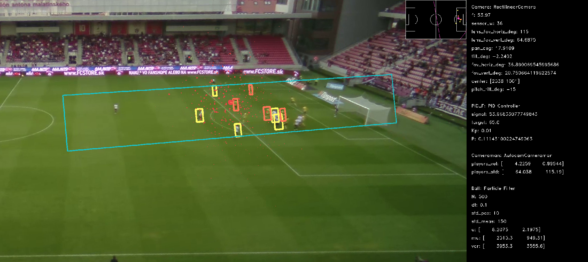

# Autocam

Autocam is an automatic virtual cameraman. The input is a wide-angle rectilinear video of a soccer match containing the full pitch. Autocam automatically finds the interesting region of each frame, crops it so that it emulates the pan-tilt-zoom (PTZ) of a camera on a tripod, and finally exports it as a new video.

The system was developed within the [master's thesis](https://is.muni.cz/th/l78dh/?lang=en) by Attila Zsíros in 2023.




## Getting Started

1. Create a [Conda environment](https://docs.conda.io/en/latest/) by first installing, e.g., [Miniconda](https://docs.conda.io/projects/miniconda/en/latest/miniconda-install.html) and then running:

    ```shell
    conda env create -f environment.yml
    conda activate autocam
    ```

2. Run Autocam on a provided sample video using the Makefile:

    ```shell
    # Run with debug visualizations.
    make debug

    # Run and control the camera by WASD keys.
    # Use the `mouse_use_pid` option in config_autocam.yaml to control the camera by the mouse.
    make debug_mouse

    # Run without visualizations.
    make no_debug

    # Record the whole clip into the "./recordings folder".
    make record
    ```

3. Use the `spacebar` to proceed to the next frame and `q` to exit.

## User Control

- `spacebar` — proceed to the next frame;
- `q` — exit;
- `-` and `+` — zoom (focal length);
- `7` and `9` — pitch tilt correction angle;
- `4` and `6` — original lens field of view;
- `2` and `8` — sensor size;
- `W`, `A`, `S`, `D` — camera movement (only in mouse mode, i.e., when executed by `make debug_mouse`);

## Config Files

Under the `/configs` folder, there are two types of config files:

- Dataset config: `config_trnava_zilina.yaml`
  - Contains, e.g., the path to the dataset, camera PTZ (pan-tilt-zoom) default values and limits, or coordinates of pitch corners.
- App config: `configs/config_autocam.yaml`
  - Contains, e.g., paths for dataset and output, constants for debugging, detection, filters, PID, or zoom limits.

For more details, refer to the parameter's descriptions in the config files.

## Scripts

Under `/scripts`, you can find shell scripts for:

- Recording full matches (`record_full_match.sh`).
  - It assumes that in the dataset folder (specified in the dataset config), there are two files:
    - `main_p0.mp4` for the first period of the match
    - `main_p1.mp4` for the second period of the match
- Recording folders of video clips (`record_clips.sh`).
  - It records all `*.mp4` files located in the specified folder.

## Methods

For a detailed description of the methods, refer to the [master's thesis](https://is.muni.cz/th/l78dh/?lang=en).

|                       Detection Pipeline                       |                          Virtual Camera Algorithm                           |
| :------------------------------------------------------------: | :-------------------------------------------------------------------------: |
|  |  |

## Cite

```bibtex
@MastersThesis{Zsiros2023,
  AUTHOR = "Zsíros, Attila",
  TITLE = "Automatic virtual soccer camera",
  YEAR = "2023",
  SCHOOL = "Masarykova univerzita, Fakulta informatiky, Brno",
  URL = "https://is.muni.cz/th/l78dh/",
}
```
